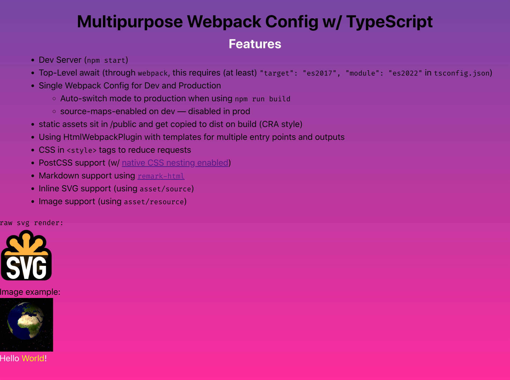

# My Multipurpose Webpack 5 Config (TypeScript)

> See https://github.com/kalaschnik/multipurpose-webpack-config for my vanialla JS config

<p align="center">

</p>

## Config Overview

- Dev Server (`npm start`)
- Top-Level await (through `webpack`, this requires (at least) `"target": "es2017", "module": "es2022"` in `tsconfig.json`)
- Single Webpack Config for Dev and Production
  - Auto-switch mode to production when using `npm run build`
  - source-maps-enabled on dev — disabled in prod
- static assets sit in /public and get copied to dist on build (CRA style)
- Using HtmlWebpackPlugin with templates for multiple entry points and outputs
- CSS in `<style>` tags to reduce requests
- PostCSS support (w/ [native CSS nesting enabled](https://www.w3.org/TR/css-nesting-1/))
- Markdown support using [`remark-html`](https://webpack.js.org/loaders/remark-loader/)
- Inline SVG support (using `asset/source`)
- Image support (using `asset/resource`)

## Replicate (initial setup)

<details>
  <summary>Show</summary>
  
  *Note that this is only the initial setup I started with. Check out the project’s config files for the current setup!*

1. Init npm

```bash
npm init -y
```

2. Install dependencies
   1. `webpack` core bundler
   2. `webpack-cli` run webpack commands
   3. `webpack-dev-server` liver server watching file changes
   4. `typescript` install specific ts version for current version
   5. `ts-loader` tells webpack how to convert ts to js

```bash
npm i -D webpack webpack-cli webpack-dev-server typescript ts-loader
```

3. Create project structure

```bash
mkdir src && touch src/index.ts && touch webpack.config.js && tsc --init
```

4. Set your desired JS `target` in `tsconfig.json` which `webpack` will respect
5. Set `// "outDir": "./",` to `"outDir": "./dist/",`

6. Add the following to your `webpack.config.js` ([from the docs](https://webpack.js.org/guides/typescript/#basic-setup))

```javascript
const path = require('path');

const path = require('path');

module.exports = {
  entry: './src/index.ts',
  module: {
    rules: [
      {
        test: /\.tsx?$/,
        use: 'ts-loader',
        exclude: /node_modules/,
      },
    ],
  },
  resolve: {
    extensions: ['.tsx', '.ts', '.js'],
  },
  output: {
    filename: 'bundle.js',
    path: path.resolve(__dirname, 'dist'),
  },
  devtool: 'source-map',
};
```

7. Enable source-maps (for debugging) in `tsconfig.json`: `"sourceMap": true,`

8. Add an `index.html` in your root pointing to `<script src="dist/bundle.js"></script>`

9. Setup `scripts` in `package.json`:

```javascript
"scripts": {
    "start": "webpack serve",
    "build": "webpack"
  },
```

</details>
